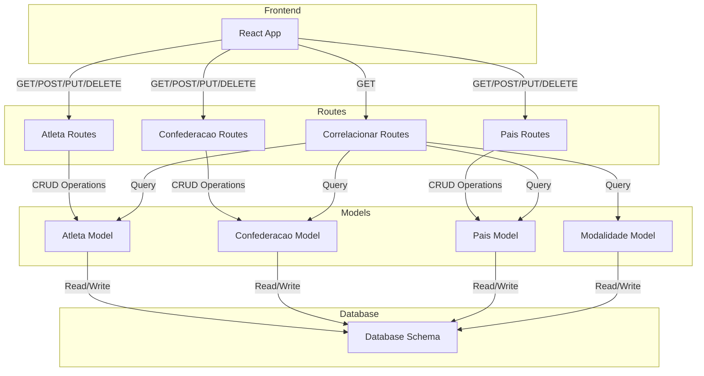

# Olimpiadas BD

Este projeto é uma aplicação de gerenciamento de dados de Olimpíadas, incluindo a criação e manipulação de um banco de dados, bem como a execução da aplicação principal (back-end) e do front-end.

## Pré-requisitos

- Python 3.10 ou superior
- Node.js e npm (para o front-end)
- Pip (gerenciador de pacotes do Python)
- Virtualenv (opcional, mas recomendado para criar um ambiente virtual)

## Configuração do Ambiente

### Configuração do Back-end

1. **Clone o repositório:**

   ```bash
   git clone https://github.com/seu-usuario/olimpiadas_bd.git
   cd olimpiadas_bd
   ```

2. **Crie um ambiente virtual (opcional, mas recomendado):**

   ```bash
   python -m venv venv
   ```

3. **Ative o ambiente virtual:**

   - No Windows:

     ```bash
     venv\Scripts\activate
     ```

   - No Linux/Mac:

     ```bash
     source venv/bin/activate
     ```

4. **Instale as dependências:**

   ```bash
   pip install -r requirements.txt
   ```

### Configuração do Banco de Dados

1. **Crie o banco de dados:**

   Execute o script `create_db.py` que está na pasta `scripts` para criar o banco de dados:

   ```bash
   python scripts/create_db.py
   ```

2. **Popule o banco de dados com os dados iniciais:**

   Execute o script `insert.py` que está na pasta `scripts` para popular o banco de dados:

   ```bash
   python scripts/insert.py
   ```

### Executando o Back-end

1. **Inicie o back-end:**

   Execute o arquivo principal `main.py` para rodar a aplicação:

   ```bash
   python main.py
   ```

### Configuração do Front-end

1. **Acesse o diretório do front-end:**

   ```bash
   cd olimpiadas-app
   ```

2. **Instale as dependências do front-end:**

   ```bash
   npm install
   ```

3. **Inicie o front-end:**

   ```bash
   npm start
   ```

4. **Acesse a aplicação no navegador:**

   A aplicação estará disponível no endereço:

   ```plaintext
   http://localhost:3000
   ```


## Estrutura de Diretórios

- **`database/`**: Contém scripts relacionados ao banco de dados.
- **`models/`**: Define os modelos utilizados na aplicação.
- **`olimpiadas-app/`**: Diretório principal da aplicação front-end.
- **`routes/`**: Define as rotas da aplicação back-end.
- **`scripts/`**: Scripts auxiliares como `create_db.py` e `insert.py`.
- **`static/`**: Arquivos estáticos (CSS, JS, imagens).
- **`tests/`**: Testes unitários e de integração.
- **`venv/`**: Ambiente virtual (não é versionado).

## Problemas Comuns

- **Erro de conexão com o banco de dados:** Verifique se o banco de dados foi criado e populado corretamente.
- **Dependências faltando:** Confirme se as bibliotecas necessárias foram instaladas corretamente com `pip install -r requirements.txt` e `npm install` para o front-end.


---

## Visão Geral

Esta documentação descreve o funcionamento da aplicação, detalhando o fluxo de dados entre as diferentes camadas: Frontend, Routes, Models e Database. A aplicação é uma plataforma de gerenciamento de atletas, confederações e países, construída com Flask para a API backend e React para o frontend.

## Arquitetura da Aplicação

### Componentes Principais

1. **Frontend**
2. **Routes (Rotas)**
3. **Models (Modelos)**
4. **Database (Banco de Dados)**

### Diagrama de Fluxo de Dados



## Fluxo de Dados

### 1. Frontend

O Frontend é a interface do usuário, construída com React. Os usuários interagem com a aplicação através da interface gráfica, que permite a execução de operações como criar, ler, atualizar e excluir dados. O Frontend realiza chamadas HTTP para as rotas da API para executar essas operações.

- **Operações CRUD**: O Frontend pode enviar requisições HTTP (GET, POST, PUT, DELETE) para as rotas da API para manipular os dados.

### 2. Routes (Rotas)

As rotas da aplicação são responsáveis por processar as requisições recebidas do Frontend e interagir com os modelos de dados. Cada rota é definida para um conjunto específico de operações relacionadas a Atletas, Confederações, Países e correlações.

- **Atleta Routes**: Manipula as operações CRUD relacionadas aos atletas.
- **Confederacao Routes**: Manipula as operações CRUD relacionadas às confederações.
- **Pais Routes**: Manipula as operações CRUD relacionadas aos países.
- **Correlacionar Routes**: Realiza consultas que envolvem múltiplos modelos, retornando dados relacionados a atletas, confederações, países e modalidades.

### 3. Models (Modelos)

Os modelos representam as estruturas de dados no banco de dados. Eles são definidos usando SQLAlchemy e são responsáveis por mapear as tabelas do banco de dados para classes Python.

- **Atleta Model**: Representa a tabela de atletas, incluindo atributos como nome, gênero, data de nascimento, ID da confederação e ID da modalidade.
- **Confederacao Model**: Representa a tabela de confederações, incluindo atributos como nome e ID do país.
- **Pais Model**: Representa a tabela de países, incluindo atributos como nome, sigla e bandeira.
- **Modalidade Model**: Representa a tabela de modalidades, incluindo atributos como nome.

### 4. Database (Banco de Dados)

O banco de dados armazena as informações persistentes da aplicação. Ele é estruturado com várias tabelas, conforme os modelos definidos.

- **Database Schema**: Define as tabelas e relacionamentos no banco de dados, permitindo a leitura e escrita de dados conforme solicitado pelas rotas da API.

## Exemplos de Fluxo de Dados

### Criação de um Novo Atleta

1. **Frontend**: O usuário preenche um formulário para criar um novo atleta e envia os dados.
2. **Atleta Routes**: A rota `/atleta` (POST) recebe os dados e cria um novo registro no modelo `Atleta`.
3. **Atleta Model**: O modelo `Atleta` salva o novo atleta no banco de dados.
4. **Database**: O banco de dados armazena o novo registro na tabela de atletas.

### Listagem de Atletas

1. **Frontend**: O usuário solicita a lista de atletas.
2. **Atleta Routes**: A rota `/atleta` (GET) solicita os dados dos atletas.
3. **Atleta Model**: O modelo `Atleta` consulta o banco de dados para obter a lista de atletas.
4. **Database**: O banco de dados retorna a lista de atletas.
5. **Atleta Routes**: Os dados são enviados de volta ao Frontend.
6. **Frontend**: A lista de atletas é exibida ao usuário.

### Detalhamento de um Atleta

1. **Frontend**: O usuário solicita os detalhes de um atleta específico.
2. **Atleta Routes**: A rota `/atleta/<id>` (GET) solicita os dados do atleta, incluindo informações da confederação, país e modalidade.
3. **Atleta Model**: O modelo `Atleta` consulta o banco de dados e junta informações de outros modelos conforme necessário.
4. **Database**: O banco de dados retorna as informações detalhadas.
5. **Atleta Routes**: Os dados detalhados são enviados ao Frontend.
6. **Frontend**: As informações detalhadas são exibidas ao usuário.

---
